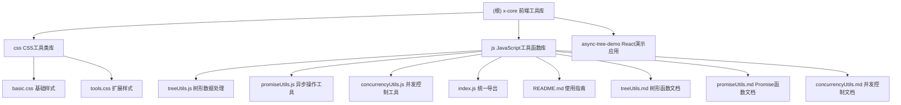

# CLAUDE.md

This file provides guidance to Claude Code (claude.ai/code) when working with code in this repository.

## 项目愿景

这是一个专注于前端开发的工具库集合，旨在提供高质量、可复用的 CSS 工具类和 JavaScript 工具函数，帮助开发者提高开发效率和代码质量。

## 架构总览

### 核心设计理念
- **模块化设计**：每个功能模块独立，可单独使用或组合使用
- **原子化原则**：CSS 工具类遵循原子化设计理念，提供细粒度的样式控制
- **实用主义**：JavaScript 工具函数解决实际开发中的常见问题
- **高性能**：所有工具都经过性能优化，适合生产环境使用

### 技术栈
- **CSS 工具类**：纯 CSS，无依赖
- **JavaScript 工具库**：ES6 模块，支持现代浏览器和 Node.js
- **文档系统**：Markdown 格式，详细的函数说明和使用示例

## 模块结构图



## 模块索引

| 模块名 | 路径 | 类型 | 功能描述 | 文件数量 | 覆盖率 |
|--------|------|------|----------|----------|--------|
| CSS 工具类库 | `/css/` | 样式工具 | 原子化 CSS 类，提供基础样式和布局工具 | 2 | 100% |
| JavaScript 工具函数库 | `/js/` | 函数工具 | 27 个实用函数，涵盖树形数据处理、异步操作、并发控制 | 6 | 100% |
| React 演示应用 | `/async-tree-demo/` | 演示应用 | 基于 Ant Design 的异步树形组件演示 | 已删除 | - |

## 运行与开发

### 开发环境要求
- **Node.js**: 14+ (用于 JavaScript 工具库和测试)
- **浏览器**: 现代浏览器 (ES6+ 支持)
- **构建工具**: 无需构建，直接使用 ES6 模块
- **测试环境**: 建议使用 Node.js 环境或支持 ES6 模块的测试框架

### 常用开发命令

#### 测试和验证
```bash
# 在 Node.js 环境中测试单个模块
node -e "import('./js/treeUtils.js').then(m => console.log('treeUtils loaded:', Object.keys(m)))"
node -e "import('./js/promiseUtils.js').then(m => console.log('promiseUtils loaded:', Object.keys(m)))"
node -e "import('./js/concurrencyUtils.js').then(m => console.log('concurrencyUtils loaded:', Object.keys(m)))"

# 快速功能测试
node -e "import('./js/treeUtils.js').then(({findNode}) => console.log(findNode([{id:1,children:[{id:2}]}], n=>n.id===2)))"
```

#### CSS 工具类验证
```bash
# 启动简单的 HTTP 服务器测试 CSS
python -m http.server 8000  # Python 3
# 或
php -S localhost:8000       # PHP
# 或安装 serve 包
npm install -g serve && serve .

# 创建测试页面
echo '<!DOCTYPE html><html><head><link rel="stylesheet" href="css/basic.css"><link rel="stylesheet" href="css/tools.css"></head><body><div class="flex items-center justify-center truncate">测试内容</div></body></html>' > test.html
```

#### Git 工作流
```bash
# 查看项目状态
git status

# 提交更改（遵循语义化提交规范）
git add .
git commit -m "feat: 添加新的树形处理函数"
git commit -m "fix: 修复并发控制中的内存泄漏"
git commit -m "docs: 更新函数使用文档"

# 同步更新
git pull origin main
git push origin main
```

### 使用方式

#### CSS 工具类
```html
<!-- 直接引入 CSS 文件 -->
<link rel="stylesheet" href="css/basic.css">
<link rel="stylesheet" href="css/tools.css">

<!-- 使用原子化类名 -->
<div class="flex items-center justify-center truncate">内容</div>
```

#### JavaScript 工具库
```javascript
// 统一导入所有工具
import { treeUtils, promiseUtils, concurrencyUtils } from './js/index.js';

// 单独导入模块
import { findNode, flattenTree } from './js/treeUtils.js';
import { promiseRetry, asyncPool } from './js/promiseUtils.js';

// 使用示例
const treeData = [
  { id: 1, name: '根节点', children: [
    { id: 2, name: '子节点' }
  ]
];

const node = findNode(treeData, n => n.id === 2);
const flatData = flattenTree(treeData);
```

## 架构设计与模式

### 核心设计模式
```
工具库架构层次：
┌─────────────────────────────────────┐
│              用户层                   │  
├─────────────────────────────────────┤
│         统一导出层 (index.js)         │  ← 提供统一的API接口
├─────────────────────────────────────┤
│    功能模块层                        │
│  ┌─────────────┐ ┌─────────────┐    │
│  │  treeUtils  │ │promiseUtils │    │  ← 独立的功能模块
│  └─────────────┘ └─────────────┘    │
│  ┌─────────────┐ ┌─────────────┐    │
│  │concurrency  │ │  CSS Utils  │    │
│  │   Utils     │ │             │    │
│  └─────────────┘ └─────────────┘    │
├─────────────────────────────────────┤
│           基础工具层                  │  ← 原生 JS/CSS 功能
└─────────────────────────────────────┘
```

### 模块间依赖关系
- **零依赖设计**: 每个模块都是独立的，互不依赖
- **ES6 模块**: 支持按需导入，摇树优化友好
- **函数式编程**: 纯函数设计，无副作用，易于测试和复用

### 使用模式示例
```javascript
// 模式1: 全量导入
import xCore from './js/index.js';
const node = xCore.treeUtils.findNode(data, predicate);

// 模式2: 按模块导入
import { treeUtils, promiseUtils } from './js/index.js';
const result = await promiseUtils.promiseRetry(apiCall);

// 模式3: 按需导入（推荐）
import { findNode, asyncPool } from './js/index.js';
const results = await asyncPool(5, tasks, processor);
```

## 测试策略

### 当前状态
- **CSS 工具类**：通过视觉测试验证
- **JavaScript 工具库**：文档中包含详细的使用示例和测试用例
- **集成测试**：建议添加单元测试框架

### 手动测试流程
```bash
# 1. 功能完整性测试
node -e "import('./js/index.js').then(m => console.log('所有函数:', Object.keys(m).length))"

# 2. 基础功能测试
node -e "import('./js/treeUtils.js').then(({findNode,flattenTree}) => { const tree=[{id:1,children:[{id:2}]}]; console.log('查找结果:', findNode(tree,n=>n.id===2)); console.log('扁平化:', flattenTree(tree).length); })"

# 3. 异步功能测试
node -e "import('./js/promiseUtils.js').then(({promiseTimeout}) => promiseTimeout(Promise.resolve('OK'), 1000).then(console.log))"
```

### 建议改进
1. **添加自动化测试**：使用 Jest 或 Mocha 进行单元测试
2. **性能测试**：对关键函数进行性能基准测试
3. **跨浏览器测试**：确保在不同浏览器中的兼容性

## 编码规范

### CSS 规范
- **命名约定**：使用短横线命名法 (kebab-case)
- **类名设计**：语义化、可复用、原子化
- **组织结构**：按功能分组，基础样式 + 扩展样式

### JavaScript 规范
- **ES6+ 语法**：使用现代 JavaScript 特性
- **模块化**：使用 ES6 模块系统
- **文档注释**：详细的 JSDoc 注释
- **错误处理**：完善的异常处理机制
- **性能优化**：避免内存泄漏，优化算法复杂度

## 开发指导原则

### 代码风格要求
- **JavaScript 规范**: 严格遵循 ES6+ 标准
- **函数设计**: 纯函数优先，避免副作用
- **错误处理**: 完善的异常处理和边界情况考虑
- **性能优化**: 关注时间复杂度和空间复杂度
- **注释规范**: 使用 JSDoc 格式，详细说明参数和返回值

### 新增功能开发流程
1. **需求分析**: 确定功能的适用场景和API设计
2. **模块归属**: 判断应该放入哪个模块（tree/promise/concurrency）
3. **接口设计**: 保持与现有函数一致的命名和参数风格
4. **实现开发**: 编写核心逻辑，确保边界情况处理
5. **文档更新**: 更新对应的 .md 文档和使用示例
6. **导出配置**: 在 index.js 中添加新函数的导出

### 常见开发任务

#### 添加新的树形处理函数
```javascript
// 1. 在 treeUtils.js 中实现
export function newTreeFunction(tree, options) {
    // 实现逻辑
}

// 2. 在 index.js 中添加导出
export const { /* 现有函数 */, newTreeFunction } = treeUtils;

// 3. 更新 treeUtils.md 文档
```

#### 添加新的CSS工具类
```css
/* 在 tools.css 或 basic.css 中添加 */
.new-utility-class { /* 样式定义 */ }

/* 遵循原子化命名原则 */
/* 例如: .text-shadow { text-shadow: 0 1px 2px rgba(0,0,0,0.1); } */
```

## AI 使用指引

### 代码生成最佳实践
- **CSS 工具类**：遵循原子化设计，单一职责原则
- **JavaScript 函数**：基于现有模式，保持API风格一致
- **文档更新**：同步更新相关文档和使用示例
- **性能基准**：新函数需要考虑性能影响

### 代码审查要点
- **错误处理**：检查边界情况和异常处理
- **性能考虑**：关注函数的时间复杂度和空间复杂度
- **兼容性**：确保代码在 Node.js 和现代浏览器中运行
- **可维护性**：保持代码结构清晰，注释完整

### 扩展建议
- **TypeScript 支持**：考虑添加 .d.ts 类型定义文件
- **测试覆盖**：增加自动化测试覆盖率
- **性能监控**：添加性能监控和基准测试

## 变更记录 (Changelog)

### 2025-08-26
- ✅ 完成项目全面分析和文档更新
- ✅ 添加模块结构图和详细索引
- ✅ 创建完整的开发指导和测试策略
- ✅ 移除已删除的 async-tree-demo 模块
- ✅ 增加架构设计模式和开发命令指引
- ✅ 完善 AI 使用指导和最佳实践

### 2024-01-XX (原版本)
- ✅ 初始版本发布
- ✅ CSS 工具类库完整实现
- ✅ JavaScript 工具库 27 个函数实现
- ✅ 完整的文档和示例

# important-instruction-reminders
Do what has been asked; nothing more, nothing less.
NEVER create files unless they're absolutely necessary for achieving your goal.
ALWAYS prefer editing an existing file to creating a new one.
NEVER proactively create documentation files (*.md) or README files. Only create documentation files if explicitly requested by the User.